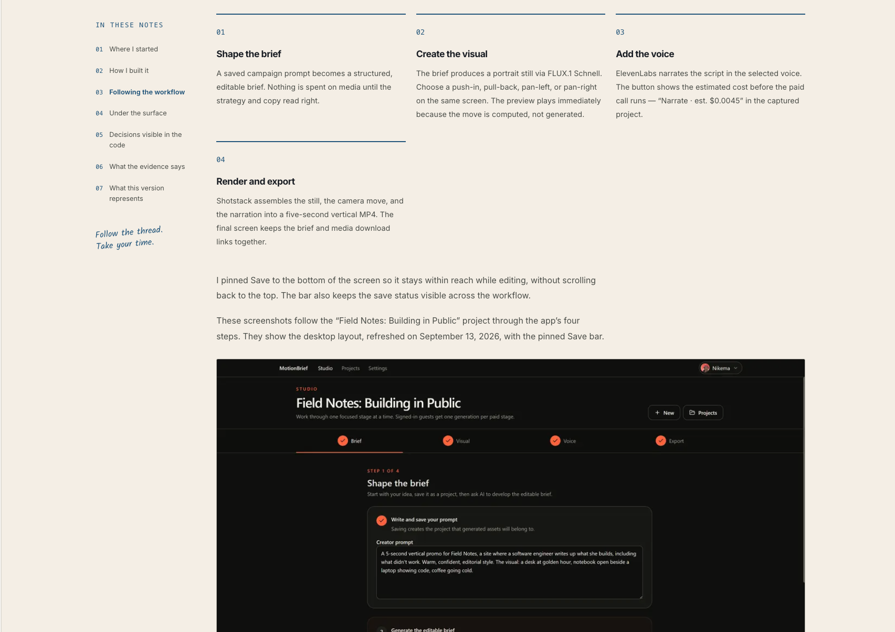

# Nikema / Field notes

A local Next.js + TypeScript + MDX case-study portfolio in the approved **builder’s studio with notebook touches** direction: warm paper, ink blue, expressive sans-serif type, and small handwritten annotations.

## Screenshots

## Run locally

Requires Node 22.18+ and npm. Run `npm ci`, then `npm run dev` and open http://127.0.0.1:5188. Fonts are bundled locally; there are no third-party embeds or required API keys.

## Verification

- `npm run validate:content`
- `npm run lint`
- `npm run typecheck`
- `npm run test -- --run`
- `npm run build`
- `npx playwright install chromium` (one-time browser setup)
- `npm run test:e2e` (run after build; starts a production server on 5189 and reuses/starts development on 5188)

The browser suite covers both pages at 320, 390, 768, and 1440px, axe accessibility checks, keyboard navigation and disclosures, enlarged text, reduced motion, and actual production draft exclusion. Screenshots are saved in `docs/screenshots/`.

## Add a study

See [the authoring guide](docs/authoring-case-studies.md) and `content/templates/case-study.mdx`. New studies use the generic `/case-studies/[slug]` route.

## Publication status

Two studies are published and evidence-reviewed: Social Content Agent and MotionBrief. Provenance and verification notes live in [docs/](docs/): [Social Content Agent](docs/social-content-agent-sources.md), [MotionBrief](docs/motionbrief-sources.md), and [implementation verification](docs/verification.md).

Drafts render only in development. Production returns 404 for their URLs and excludes them from the homepage and sitemap. Publication requires reviewed evidence and a real cover. The confirmed production canonical origin is `https://work.nikema.dev`, used by default for canonical links, the sitemap, and the production robots sitemap URL. `SITE_URL` can explicitly override it if the owner changes domains. Local development requests no indexing.

The site is deployed at https://work.nikema.dev.

## Handoff and design history

The original `START-HERE.md`, `PRD.md`, `CODEX-PROMPT.md`, and `sketches/` are retained unchanged. The later conversation approval supersedes the original cool-blue visual direction; see [design decision](docs/design-decision.md). Their original manifest describes the original handoff files only.

Implementation references: [MDX evaluate](https://mdxjs.com/packages/mdx/#evaluatefile-options) and [Next.js route generation](https://nextjs.org/docs/app/api-reference/functions/generate-static-params). Only repository-local, validated MDX is compiled on the server; no remote MDX is accepted.
